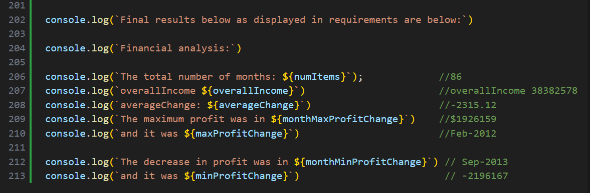
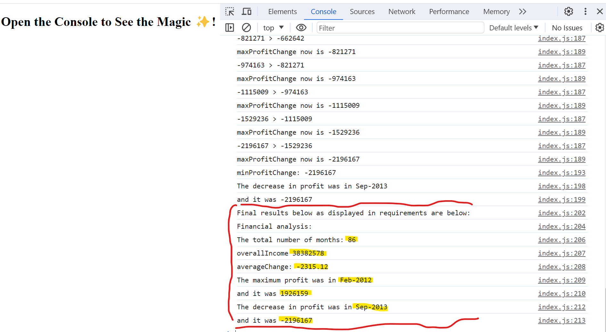

# Console-Finances

## Motivation:
To work out financial analysis using javascript

## techniques used in js
* manipulating 2D arrays
* FOR loops
* logging output in console
* using log for debugging

## Further improvements

* There can be added interface displaying the output instead of giving output in console

## Screenshot of the site at current state

